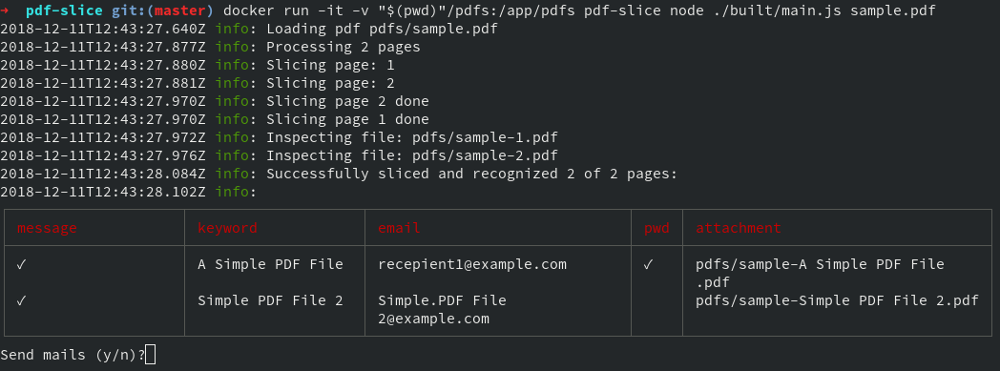

# pdf-slice

## Functionality:
* Slice a milti-page PDF by pages into multiple PDFs.
* Inspect all PDFs and find keyword matches for configuration.
* (optionally) password protect and mail PDFs to given mail addresses

## Example:

## Environment/prerequisites:
* `Docker` OR 
* Local environment with:
  * `Node.js 8`
  * `pdftk` (and maybe for some actions even `ghostscript`), [scissors](https://github.com/tcr/scissors) depends on them
  * If mailing/password protecting: `qpdf`, [node-qpdf](https://github.com/nrhirani/node-qpdf) depends on it 

## Run

* Put pdf file into `./pdfs/`
* Create `config.json`. See `config.json.draft` and `config.ts` for definitions. Password is optional (not protected if missing). Mail is optional (uses default `name.surname@domain`)

### Docker:
* `docker build -t pdf-slice .`
* `docker run -it -v "$(pwd)"/pdfs:/app/pdfs pdf-slice node ./built/main.js sample.pdf`

### Local:
* `npm run build`
* manual run: `node ./built/main.js sample.pdf`

Use at your own risk.
